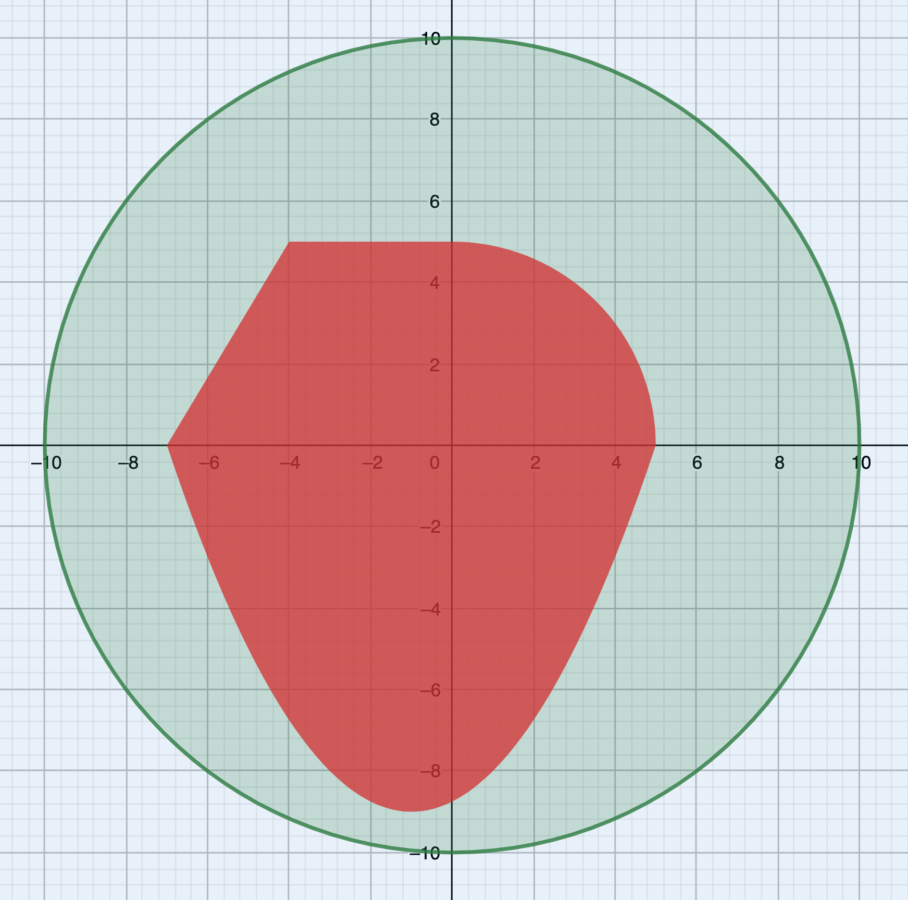

# Автоматизация безопасности

Группа исследователей собирается высадиться на остров невероятно ровной формы, но разведка при помощи спутника выяснила, что на острове есть зона зыбучих песков.

Для повышения безопасности экспедиции было решено разработать систему оповещения, которая предупредит исследователей об опасности. А для снижения расходов на производство было решено заказать программное обеспечение.

Напишите программу, которая по координатам исследователя, будет сообщать о безопасности в этой точке.

## Формат ввода

Два рациональных числа — координаты исследователя.

## Формат вывода

Одно из сообщений:

*   Опасность! Покиньте зону как можно скорее!
*   Зона безопасна. Продолжайте работу.
*   Вы вышли в море и рискуете быть съеденным акулой!

### Пример 1

Ввод

    3.5
    -3.2
    

Вывод

    Опасность! Покиньте зону как можно скорее!
    

### Пример 2

Ввод

    -5.2
    3.4
    

Вывод

    Зона безопасна. Продолжайте работу.
    

<table>
 <tr class="time-limit">
    <td class="property-title">Ограничение времени</td>
    <td>1&nbsp;секунда</td>
 </tr>
 <tr class="memory-limit">
    <td class="property-title">Ограничение памяти</td>
    <td>64.0Mb</td>
 </tr>
 <tr class="input-file">
    <td class="property-title">Ввод</td>
    <td colspan="1">стандартный ввод или input.txt</td>
 </tr>
 <tr class="output-file">
    <td class="property-title">Вывод</td>
    <td colspan="1">стандартный вывод или output.txt</td>
 </tr>
</table>
